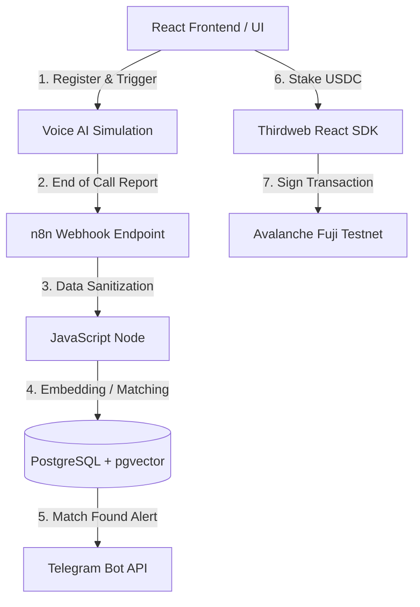

# Boardy.ai System Architecture

## Overview
Boardy.ai is an NLP-driven conversational matching engine designed for the Kuzana ecosystem in the Silicon Savannah. It connects entrepreneurs based on their specific business bottlenecks ("Needs") and resources ("Offers"). To ensure high-quality interactions and filter out bad actors, it employs a Web3 staking mechanism on the Avalanche C-Chain.

This document outlines the technical architecture of the MVP.

## 1. High-Level Architecture Flow

## 2. Core Components

### A. Frontend Layer (React + Vite)
- **Framework:** React.js bootstrapped with Vite.
- **Styling:** Custom Vanilla CSS featuring a "Silicon Savannah" dark-mode, glassmorphic aesthetic.
- **Web3 Integration:** `@thirdweb-dev/react` for seamless wallet connections. Supports Avalanche Core Wallet, MetaMask, and In-App Wallets (Email/Google social logins).
- **Core Functionality:** 
  - Simulates the Vapi Voice AI ingestion phase.
  - Generates the JSON payload containing the user's Needs and Offers.
  - Interacts directly with the n8n webhook via a Vite proxy to avoid CORS issues.
  - Handles the Avalanche C-Chain staking UI.

### B. Orchestration Layer (n8n)
- **Framework:** Self-hosted n8n workflow engine.
- **Trigger:** A HTTP POST Webhook (`/webhook-test/vapi-demo`) that listens for incoming "End-of-Call Reports" from the Voice AI/Frontend.
- **Logic:**
  - Receives JSON payload containing user phone numbers, needs, and offers.
  - Executes raw SQL statements to interact with the database.
  - Acts as the central nervous system connecting the Database and the Messaging API.

### C. Database Layer (PostgreSQL + pgvector)
- **Infrastructure:** Dockerized PostgreSQL 15 instance.
- **Extension:** `pgvector` enables high-dimensional vector similarity search.
- **Schema:**
  - `users` table: Stores `phone_number`, `wallet_address`, `need_text`, `offer_text`, and vector representations.
  - **Match Logic:** Uses Cosine Similarity (`<=>`) to match the `need_vector` of User A against the `offer_vector` of User B. If the similarity score is `>= 0.82`, a match is declared.
  - **Conflict Resolution:** Employs `UPSERT` (`INSERT ... ON CONFLICT DO UPDATE`) on the `phone_number` unique constraint to handle returning users gracefully.

### D. Messaging Layer (Telegram API)
- **Current MVP Implementation:** Telegram Bot API.
- **Production Target:** Whapi.cloud / Zoko (WhatsApp API).
- **Functionality:** Once n8n confirms a vector match in the database, it instantly fires a webhook to the Telegram Bot API to notify the matched users. The message instructs them to complete the Web3 stake to unlock the introduction room.

### E. Web3 Payment / Staking Layer (Avalanche)
- **Network:** Avalanche Fuji Testnet (Production: C-Chain Mainnet).
- **Tooling:** Thirdweb SDK.
- **Mechanism:** To unlock a high-confidence match, the user must stake 0.50 USDC. This micro-fee acts as a sybil-resistance mechanism and filters out uncommitted participants, raising the overall quality of the Boardy.ai network.

## 3. The 4-Phase Execution Pipeline

1. **Ingestion:** User registers on the React frontend. Vapi/Synthflow calls them, extracts their Need/Offer, and POSTs the transcript to n8n.
2. **Orchestration & AI:** n8n converts the text to OpenAI embeddings and stores them in PostgreSQL. `pgvector` runs a cosine similarity calculation against existing ecosystem members.
3. **Web3 Commitment:** If similarity >= 0.82, n8n pauses the flow and messages both users via Telegram, requiring a 0.50 USDC stake on Avalanche.
4. **Engagement:** The user connects their Core Wallet via the Thirdweb button on the frontend to sign the transaction. Once confirmed, the introduction group is created.

## 4. Future Scaling Considerations
- **AvaCloud Webhooks:** Replace the frontend mock staking confirmation with real-time on-chain listening via AvaCloud Webhooks to trigger n8n securely.
- **WhatsApp Integration:** Swap the Telegram HTTP node in n8n for a Whapi.cloud node to programmatically generate WhatsApp groups.
- **OpenAI Node Integration:** Currently, vector math is mocked in the MVP frontend. The n8n workflow should be updated to include an OpenAI node that generates real `text-embedding-3-small` coordinates before inserting into Postgres.
