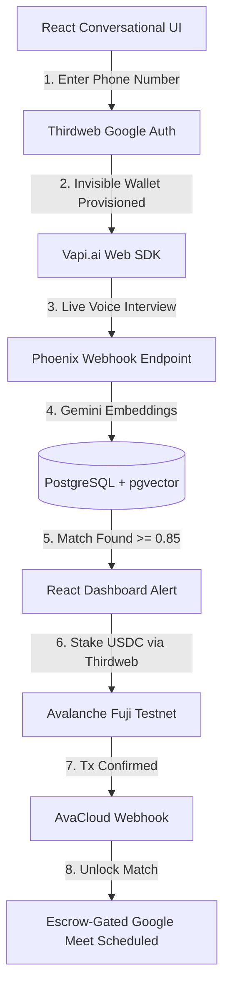

# Vokazi System Architecture

## Overview
Vokazi is an elite, voice-first Web3 professional matchmaking platform designed for the Kuzana ecosystem in the Silicon Savannah. 

It connects entrepreneurs based on their specific business bottlenecks ("Needs") and resources ("Offers"). To completely eliminate the ghosting and "spam cannon" effects seen in legacy matchmaking platforms, Vokazi implements a **Trust-Gate** using a Web3 staking mechanism on the Avalanche C-Chain, combined with Escrow-Gated Google Calendar scheduling.

## 1. High-Level Architecture Flow


```mermaid
graph TD
    A[React Conversational UI] -->|1. Enter Phone Number| B[Thirdweb Google Auth]
    B -->|2. Invisible Wallet Provisioned| C[Vapi.ai Web SDK]
    C -->|3. Live Voice Interview| D[Phoenix Webhook Endpoint]
    D -->|4. Gemini Embeddings| E[(PostgreSQL + pgvector)]
    E -->|5. Match Found >= 0.85| F[React Dashboard Alert]
    F -->|6. Stake USDC via Thirdweb| G[Avalanche Fuji Testnet]
    G -->|7. Tx Confirmed| H[AvaCloud Webhook]
    H -->|8. Unlock Match| I[Escrow-Gated Google Meet Scheduled]
```

## 2. Core Components

### A. Frontend Layer (React + Vite)
- **Framework:** React.js bootstrapped with Vite.
- **Styling:** Custom Vanilla CSS featuring a "Silicon Savannah" dark-mode, glassmorphic aesthetic.
- **Onboarding UX:** A conversational interface that mimics text messaging to lower entry friction.
- **Web3 Integration:** `@thirdweb-dev/react` In-App Wallets. When a user clicks "Sign in with Google," Thirdweb automatically provisions an Avalanche C-Chain wallet in the background. Zero crypto knowledge required.
- **Voice AI:** Integrates the Vapi Web SDK to conduct the voice interview immediately in the browser, capitalizing on the user's highest point of intent.

### B. Backend API (Elixir + Phoenix)
- **Framework:** Elixir and the Phoenix Framework running on Bandit.
- **Vapi Webhook:** An HTTP POST endpoint (`/api/vapi`) that catches the End-of-Call report from the Voice AI.
- **AI Processing (The Gemini Engine):** The system completely relies on the Google Gemini API for its intelligence via `Vokazi.AI`:
  - **The Mathematical Brain:** Uses Gemini's `gemini-embedding-2` model to translate the extracted `offer_text` and `need_text` into 768-dimensional mathematical vectors. The Elixir backend smartly pads this array to exactly 1536 dimensions so it perfectly aligns with the standard `pgvector` database schema without requiring migrations.
  - **The Backup Summarizer:** Uses `gemini-3.5-flash` as a failsafe. If the Vapi Voice AI fails to extract structured JSON data, Elixir feeds the raw transcript into Flash to forcefully synthesize a highly polished, executive summary of the user's Offer and Need.
- **Google Calendar API:** Handles the automatic scheduling of meetings once the Web3 criteria are met.

### C. Database Layer (PostgreSQL + pgvector)
- **Infrastructure:** Dockerized PostgreSQL 15 instance.
- **Extension:** `pgvector` enables high-dimensional vector similarity search.
- **Asynchronous Match Algorithm:** When `vapi_controller.ex` successfully saves a new vector, it instantly triggers a background task (`Vokazi.Matchmaking.find_pending_match`).
- **Cosine Distance Math:** The system uses `Pgvector.Ecto.Query.cosine_distance` to execute a strict mathematical scan. To find a similarity score of $\ge 0.85$, the Ecto query enforces a distance of $\le 0.15$.
  ```elixir
  query = from p in Profile,
    where: p.user_id != ^current_user_id,
    where: cosine_distance(p.offer_vector, ^user_need_vector) <= 0.15,
    order_by: [asc: cosine_distance(p.offer_vector, ^user_need_vector)],
    limit: 1
  ```
- **The Trust-Gate Trigger:** If the database yields a match, the backend instantly creates a `Match` record with `status: "pending"`. The React frontend detects this state and locks the user's UI, displaying the Avalanche Staking prompt to financially commit to the introduction.

### D. Web3 Trust-Gate (Avalanche)
- **Network:** Avalanche Fuji Testnet (Production: C-Chain Mainnet).
- **Smart Contracts:** Solidity-based Staking and Escrow contracts.
- **The Mechanism:** To unlock a high-confidence match, both users must stake 0.50 USDC using their invisible Thirdweb wallets. This filters out uncommitted participants.
- **Event Listening:** AvaCloud Webhooks monitor the smart contract. Once both stakes are verified on-chain, AvaCloud pushes a payload to the Phoenix backend.

### E. Engagement & Meeting Layer
- **Escrow-Gated Scheduling:** Vokazi does not schedule meetings up-front. Only after AvaCloud confirms both stakes does Phoenix use Google Calendar permissions to find a mutual free slot and send an invite.
- **Real-Time Chat:** Phoenix WebSockets provision a secure deal-room for the matched founders to negotiate terms before moving into a milestone-based Escrow.

## 3. The 4-Phase Execution Pipeline

1. **Frictionless Ingestion:** User drops phone number -> Signs in with Google -> Invisible Avalanche wallet created -> Live Vapi Voice Interview occurs in-browser.
2. **AI Orchestration:** Phoenix backend receives transcript, creates embeddings, and finds a `pgvector` match $\ge 0.85$.
3. **The Trust-Gate:** The backend halts the flow. Users are notified to stake 0.50 USDC on Avalanche to prove intent.
4. **Verified Engagement:** AvaCloud confirms the stakes, Phoenix schedules the Google Meeting, and the secure WebSocket chat room is unlocked.
