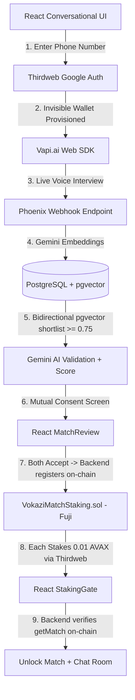

# Vokazi System Architecture

## Overview
Vokazi is an elite, voice-first Web3 professional matchmaking platform designed for the Kuzana ecosystem in the Silicon Savannah. 

It connects entrepreneurs based on their specific business bottlenecks ("Needs") and resources ("Offers"). To completely eliminate the ghosting and "spam cannon" effects seen in legacy matchmaking platforms, Vokazi implements a **Trust-Gate** using a Web3 staking mechanism on the Avalanche C-Chain, combined with Escrow-Gated Google Calendar scheduling.

## 1. High-Level Architecture Flow

```mermaid
graph TD
    A[React Conversational UI] -->|1. Enter Phone Number| B[Thirdweb Google Auth]
    B -->|2. Invisible Wallet Provisioned| C[Vapi.ai Web SDK]
    C -->|3. Live Voice Interview| D[Phoenix Webhook Endpoint]
    D -->|4. Gemini Embeddings| E[(PostgreSQL + pgvector)]
    E -->|5. Bidirectional pgvector shortlist >= 0.75| F[Gemini AI Validation + Score]
    F -->|6. Mutual Consent Screen| G[React MatchReview]
    G -->|7. Both Accept -> Backend registers on-chain| H[VokaziMatchStaking.sol - Fuji]
    H -->|8. Each Stakes 0.01 AVAX via Thirdweb| I[React StakingGate]
    I -->|9. Backend verifies getMatch on-chain| J[Unlock Match + Chat Room]
```

## 2. Core Components

### A. Frontend Layer (React + Vite)
- **Framework:** React.js bootstrapped with Vite.
- **Styling:** Custom Vanilla CSS featuring a "Silicon Savannah" dark-mode, glassmorphic aesthetic.
- **Onboarding UX:** A conversational interface that mimics text messaging to lower entry friction.
- **Web3 Integration:** `@thirdweb-dev/react` In-App Wallets. When a user clicks "Sign in with Google," Thirdweb automatically provisions an Avalanche C-Chain wallet in the background. Zero crypto knowledge required.
- **Voice AI:** Integrates the Vapi Web SDK to conduct the voice interview immediately in the browser, capitalizing on the user's highest point of intent.

### B. Backend API (Elixir + Phoenix)
- **Framework:** Elixir and the Phoenix Framework running on Bandit.
- **Vapi Webhook:** An HTTP POST endpoint (`/api/vapi`) that catches the End-of-Call report from the Voice AI.
- **AI Processing (The Gemini Engine):** The system completely relies on the Google Gemini API for its intelligence via `Vokazi.AI`:
  - **The Mathematical Brain:** Uses Gemini's `gemini-embedding-2` model to translate the extracted `offer_text` and `need_text` directly into 1536-dimensional mathematical vectors, requesting `outputDimensionality: 1536` so the vector Gemini returns is already the correctly-normalized Matryoshka truncation (unit norm) — no manual padding or slicing.
  - **The Summarizer:** Uses `gemini-3.5-flash` to turn the raw Vapi transcript into a polished, executive-summary `offer_text`/`need_text` pair.
  - **The Match Validator:** Also uses `gemini-3.5-flash` (`Vokazi.AI.validate_match/2`) as the judgment layer on top of pgvector. For each shortlisted candidate it decides whether the fit is genuinely complementary (not just lexically similar), and returns a 0-100 confidence score, a reasoning summary, transparent "what lines up" (`strengths`) / "what's uncertain" (`gaps`) breakdowns, and a ready-to-send introduction message — so neither user is ever handed a bare, unexplained percentage.
- **Google Calendar API:** Handles the automatic scheduling of meetings once the Web3 criteria are met.

### C. Database Layer (PostgreSQL + pgvector)
- **Infrastructure:** Dockerized PostgreSQL 15 instance.
- **Extension:** `pgvector` enables high-dimensional vector similarity search.
- **Asynchronous Match Algorithm:** When `vapi_controller.ex` successfully saves a new vector, it instantly triggers a background task (`Vokazi.Matchmaking.find_pending_match`), which also backs the on-demand "Find a Match" button (`find_match!/1`).
- **Bidirectional Cosine Distance Math:** The system uses `Pgvector.Ecto.Query.cosine_distance` to score candidates in *both* directions — my need against their offer, and their need against my offer — and takes the `min()` of the two, so a match has to hold up on both sides rather than being carried by one strong direction. A cheap SQL pass narrows the field to a candidate pool first; the bidirectional score, a `0.75` similarity floor, and a recency tie-break are then applied over that pool, and anyone already matched with is excluded.
- **AI Validation Layer:** The top candidates (best-first) are sent to `Vokazi.AI.validate_match/2`. The first one Gemini marks `is_valid: true` with a score `>= 70` wins; if none clear the bar, the user is `{:queued}` rather than forced into a low-confidence match.
- **The Trust-Gate Trigger:** Once a candidate clears both stages, the backend creates a `Match` record with `status: "pending_consent"` carrying the similarity score, AI score, reasoning, strengths, gaps, and intro message. The React `MatchReview` screen shows this full breakdown to both users, who each independently accept or decline (`Matchmaking.respond_to_match/4` - a decline requires a short reason, kept for tuning future matching). Once *both* accept, status moves to `"pending"` and the backend registers the match on-chain (see below) - the Avalanche Staking prompt is next, not an immediate unlock.

### D. Web3 Trust-Gate (Avalanche) - `Vokazi.Avalanche`
- **Network:** Avalanche Fuji Testnet, contract `VokaziMatchStaking.sol` deployed at `0x3e5E4D5FA56fa78F9665Bc36b8D08964Dc790eFA`.
- **Backend chain access:** `ethers` + `ex_keccak` + `ex_secp256k1` (Elixir) give the backend real JSON-RPC/ABI/signing capability - there is no mock here anymore.
- **The Mechanism:** Once both sides mutually accept, the backend (the contract's owner, via `Ethers.Signer.Local` and the deployer's private key) submits `createMatch(matchId, userA, userB)`, registering both wallet addresses under a deterministic id (`keccak256("vokazi-match-{id}")`). Each user then independently calls the contract's `stake()` themselves, from their own Thirdweb wallet, sending exactly **0.01 native AVAX** (not USDC).
- **Verification (in place of AvaCloud Webhooks):** Rather than subscribing to AvaCloud's real-time event product, the backend re-reads `getMatch` directly off the contract via `Vokazi.Avalanche.get_match_onchain/1` whenever a user reports a stake (`POST /matches/:id/confirm-stake`), and only records `user_a_staked`/`user_b_staked` and unlocks the chat room based on what the contract itself reports - the frontend's claim that a transaction succeeded is never trusted on its own.

### E. Engagement & Meeting Layer
- **Real-Time Chat:** Phoenix WebSockets provision a secure deal-room for the matched founders, provisioned the moment both stakes are verified on-chain.
- **Escrow-Gated Scheduling:** Not yet built - the Google Calendar auto-scheduling described in the original pitch still needs the same treatment the staking gate just got.

## 3. The 4-Phase Execution Pipeline

1. **Frictionless Ingestion:** User drops phone number -> Signs in with Google -> Invisible Avalanche wallet created -> Live Vapi Voice Interview occurs in-browser.
2. **AI Orchestration:** Phoenix backend receives the transcript, creates embeddings, shortlists candidates via bidirectional `pgvector` similarity ($\ge 0.75$), and has Gemini validate the best candidate for a genuinely complementary fit (score, reasoning, strengths, gaps).
3. **Mutual Consent & The Trust-Gate:** Both users review the full score breakdown and independently accept or decline (a decline requires a reason). Once both accept, the backend registers the match on `VokaziMatchStaking.sol` and each user stakes 0.01 AVAX from their own wallet via `StakingGate.jsx`.
4. **Verified Engagement:** The backend independently confirms both stakes by reading the contract directly, then unlocks the secure WebSocket chat room. Google Meet scheduling is not yet wired to this signal.
