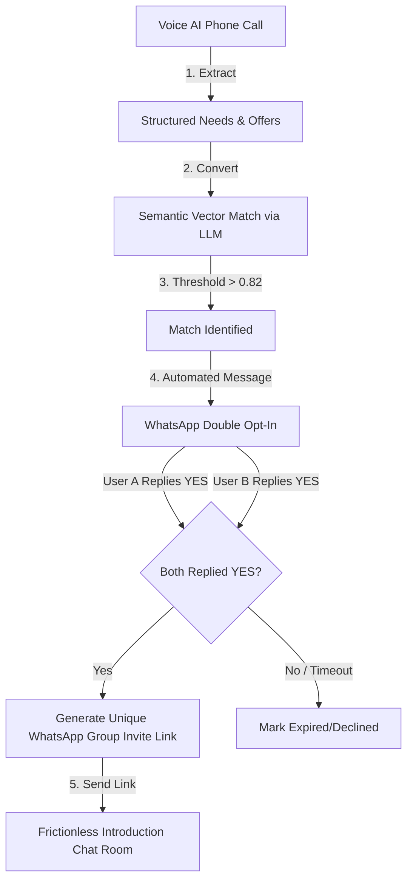

# Kuzana x MiniHack: Bounty 3 Requirements (Boardy.ai for Kuzana)

*This document serves as the absolute source of truth for the requirements provided by Kuzana for Bounty 3. It consolidates both the high-level programme brief and the detailed technical system requirements to ensure alignment throughout the build process.*

> **2026-08-06:** the shipped product deviates from this brief's suggested baseline stack in five
> places — most visibly, there is no WhatsApp integration anywhere (Phase 3/4 below describe a
> Whapi.cloud/Zoko-driven double opt-in and group creator). Every deviation was a deliberate
> cost/practicality substitution made during the build, not scope drift, and none of them change the
> underlying capability being demonstrated. See `ROADMAP.md`'s "🔀 Deviations from the Official
> Technical Brief" section for the full list and reasoning behind each one.

---

## 1. Programme Context

**Kuzana** is Kenya's fastest-growing SME accelerator, backing real businesses with serious revenue. They process over 1,300 business applications a year.
**MiniHack** has partnered with Kuzana to bring bounties on real problems CEOs face. 

This is not a theoretical hackathon. The solutions built here are intended to be actually deployed internally by Kuzana. Stage 1 requires a **working MVP**, not just a written plan or slides. The ultimate goal is to win Stage 2 by proving the solution works for a real use case.

---

## 2. Bounty 3 Overview: Boardy.ai for Kuzana

**The Problem:** Great opportunities, jobs, partnerships, mentors, investors, and customers are trapped inside people's networks. Most people never get connected to the right person because nobody knows to make the introduction.

**The Challenge:** Build an AI-powered voice or conversational matchmaking system that connects people based on their goals, challenges, expertise, and interests. A Kenya-adapted version of boardy.ai that generates meaningful introductions within the Kuzana and MiniHack ecosystem.

**The Ultimate Goal:** Mint 1,000 more millionaires by 2040 by connecting them efficiently.

### Required Skills
*   Backend engineering
*   Conversational AI & Voice interfaces
*   NLP & Embeddings
*   Recommendation systems / Matching algorithms 
*(Note: This is the most engineering-intensive bounty on the list).*

### ⚠️ Common Pitfall
**Do not try to clone Boardy.ai in its entirety from day one.** Boardy works because it has years of user data; you have none. 
**Solution:** Start with one specific matching use case within one specific community (e.g., matching MiniHack developers with Kuzana founders who need technical help). Prove the matching logic works before scaling the interface.

---

## 3. Detailed Functional Requirements

The system must mimic the core matchmaking functionality of Boardy.ai for a community of 1,000+ entrepreneurs, utilizing an **AI-Driven WhatsApp Matchmaker**.

### System Architecture Flow

### Phase 1: Voice AI Discovery Call
*   **Trigger:** Outbound call initiated via API (or inbound when requested).
*   **The Persona:** Official, highly competent community coordinator. Must use active listening, reflective summarization, and human-like pauses.
*   **Data Extraction:** The voice agent must structurally extract:
    1.  **Needs:** Current bottlenecks (e.g., "Looking for a growth marketer").
    2.  **Offers:** Areas of expertise/resources (e.g., "Scaled an e-commerce store to $5M").
*   **Payload:** Upon hang-up, trigger a webhook pushing the call transcript to the backend.

### Phase 2: AI Processing & Matching Engine
*   **Data Structuring:** Use an LLM to extract structured JSON tags from the transcript. Clean the data (remove filler words/errors).
*   **Semantic Matching:** Convert tags into vector embeddings (e.g., OpenAI `text-embedding-3-small`).
*   **Matching Logic:** Run an async cron job (e.g., every 24–48 hours) to calculate similarity scores between Member A’s Needs and Member B’s Offers.
*   **Constraints:**
    *   Do not match the same pair more than once every 60 days.
    *   Match confidence score must exceed a defined threshold (e.g., >0.82).

### Phase 3: WhatsApp Double Opt-In (1-on-1)
*   **Trigger:** High-confidence match detected.
*   **Execution:** Simultaneously send individual, highly personalized WhatsApp text messages to both founders.
*   **Templates:**
    *   *To A:* "Hi [Name A]! Our AI networker found a match. Meet [Name B]—she [Insert Summary of B's Offer], which aligns with your bottleneck. Want a direct intro? Reply YES or NO."
    *   *To B:* "Hi [Name B]! Our AI networker found a match. Meet [Name A]—he [Insert Summary of A's Need]. Want a direct intro? Reply YES or NO."
*   **State Management:** Wait up to 48 hours for an inbound webhook with "YES" or "NO".

### Phase 4: Frictionless Introduction (Group Links)
*   **Privacy Workaround:** Do NOT force-add users to a group (due to strict privacy settings). Use invite links instead.
*   **Trigger:** Both users reply "YES".
*   **Execution:**
    1.  Call WhatsApp gateway API to spin up a new group: `[Brand] [Name A] 🤝 [Name B]`.
    2.  Extract the Group Invite Link from the metadata.
    3.  Send the link to both founders via 1-on-1 WhatsApp message.
*   **Closing Message:** *"Great! You both opted in. Tap the link below to join your private introduction chat room. See you inside! 👇 [Group Invite Link]"*

---

## 4. Key Engineering Edge Cases

1.  **No/Delayed Responses:** If one party replies "NO" or fails to reply within 48 hours, mark the match as "Expired/Declined". Send a polite message to the active party: *"We couldn't lock down this intro right now, but our AI is looking for your next match!"*
2.  **WhatsApp API Limitations:** Standard Meta APIs do not easily allow automated group management. Use specialized wrappers (like Whapi.cloud or Zoko) to ensure seamless group generation and link extraction.
3.  **Data Sanitation:** Ensure the LLM strips out filler words before running semantic matching to keep vector calculations clean.

---

## 5. Official Deliverables Checklist

To successfully pass the judging criteria, the submission must include:
- [ ] Functional Voice AI prompt configuration & webhook setup.
- [ ] Database schema storing user records, vector embeddings, call history, and match states.
- [ ] Matchmaking engine cron job utilizing semantic scoring.
- [ ] Inbound message handler (Webhook parsing WhatsApp text replies for YES/NO states).
- [ ] Automated WhatsApp group creator script that generates and distributes group invite links.
- [ ] Evidence of a minimum viable user base tested within the MiniHack/Kuzana community.
- [ ] Evidence of at least 5 meaningful introductions generated and verified as useful by both parties.
- [ ] Documentation of the matching logic and how it can be improved.

---

## 6. Judging & Program Rules

### Universal Rules
1.  **Talk to users first:** Talk to 2-5 potential users/stakeholders before coding. Document what surprised you.
2.  **MVP Standard:** Stage 1 requires a working MVP (shown via a 1-minute screen recording), not just an idea.
3.  **IP:** You own your IP. Kuzana gets a perpetual royalty-free license to use/modify it internally and right of first refusal for investment if it becomes a company.

### Judging Criteria
| Criterion | Weight | Definition |
| :--- | :--- | :--- |
| **Problem Understanding** | 25% | Did you talk to at least 5 stakeholders? What surprised you? |
| **Solution Quality** | 25% | Does it work? Is it practical? Could Kuzana deploy it this week? |
| **User Feedback** | 25% | Did real people use it? What did they say? Show evidence. |
| **Execution** | 25% | Is it documented? Is the process repeatable? Can someone else pick it up? |
