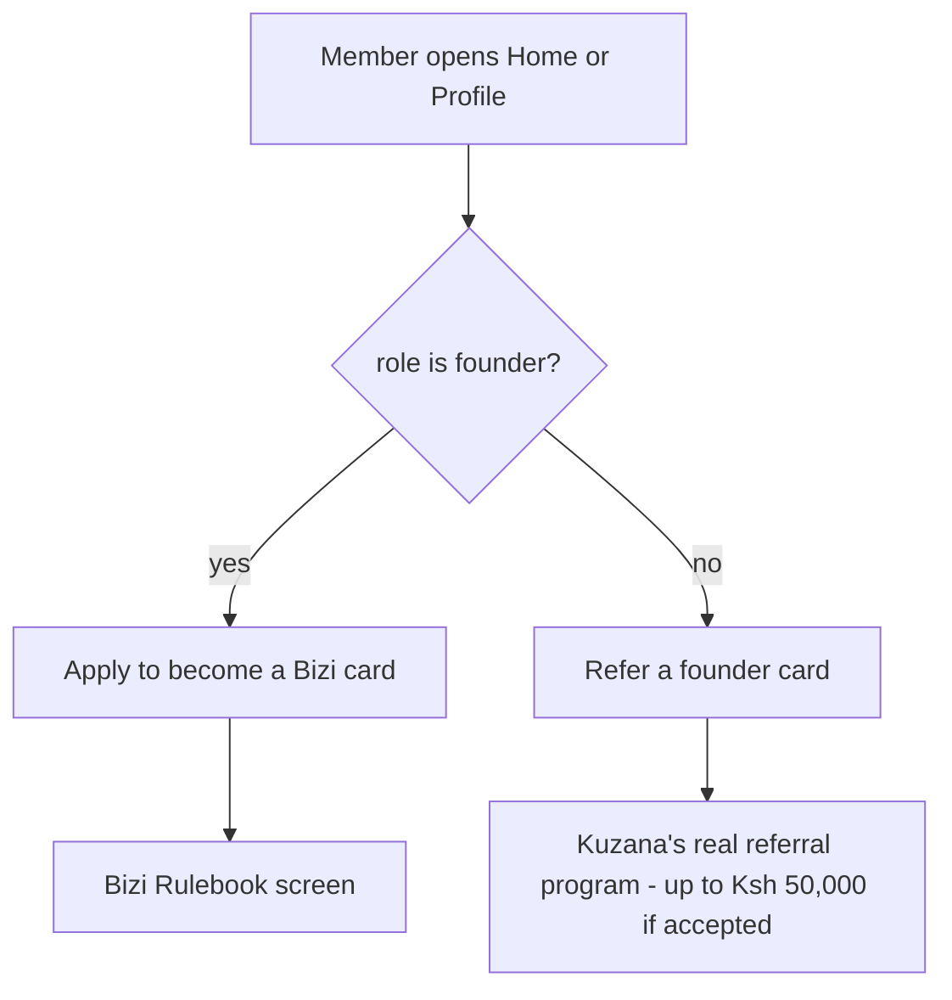
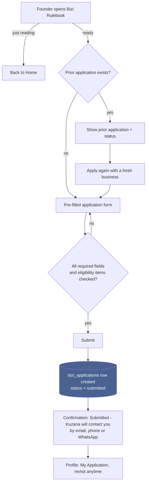
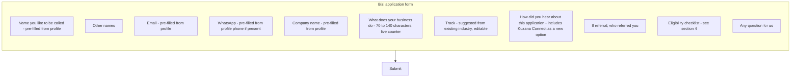
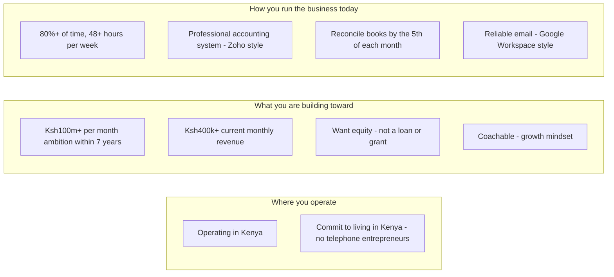
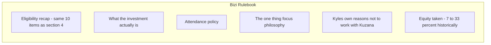
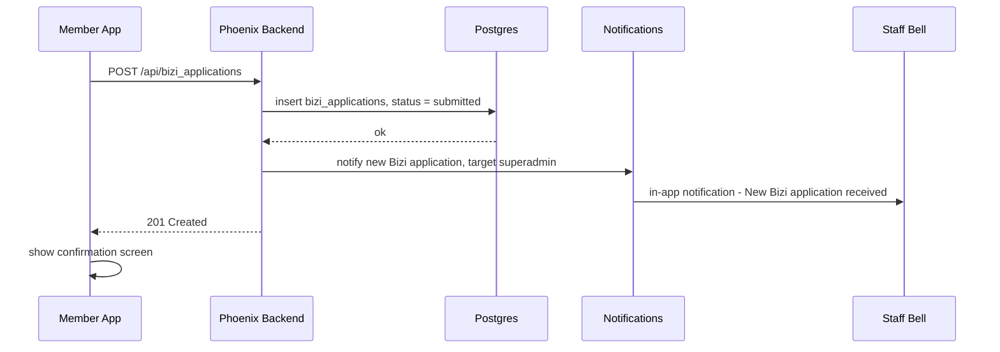
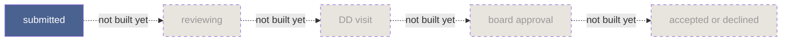
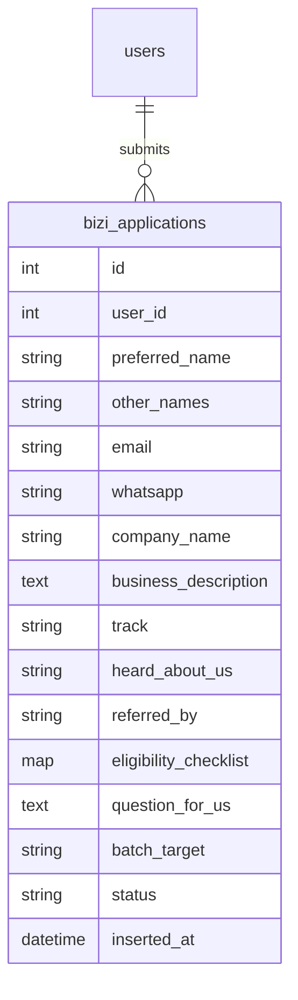

# Bizi Application & Rulebook — Flow Design

**Written 2026-07-27. Rebuilt 2026-07-27** after reading Kuzana's actual live application form at
`form.kuzana.co/apply` directly (see `kuzana_website.md` §9 for the full verbatim capture) - this
version replaces an earlier draft that extrapolated field names from process *descriptions* rather
than the real form. Scope locked with the product owner: **Apply + Rulebook only**, for **existing
Kuzana Connect members** (no separate public/cold-applicant form, no staff review pipeline yet - see
§7 for what that means and what's deliberately deferred).

Design principle for this whole feature: **be Kuzana's real form, not a generic accelerator
application**, while using the fact that the applicant is already a Connect member to remove
friction the real form can't - pre-fill what we already know, and don't show the feature at all to
people Kuzana would reject anyway.

---

## 1. Who even sees this feature

Kuzana's real form is explicit: *"The applicant MUST be the CEO who will attend the Kuzana
workshops. Applications from transaction advisors, non-operational investors, CFO or Executive
Assistants not accepted."* Connect already knows `role` for every member - so instead of letting a
consultant or investor fill out a whole form and get rejected at the end, the feature branches
before it's ever shown:

This is the single biggest usability decision in this design - it turns a rejection into a better-
fitting offer, using data Connect already has.

## 2. The member-facing journey (founders only, from here on)

The Rulebook is never gated behind starting an application - anyone eligible can read it out of
pure curiosity. And a prior application is never hidden or silently overwritten - Kuzana's own form
lists "Reapplication" as an expected, normal lead source, not an edge case.

## 3. The application form - real fields, smart pre-fill

Every field below is real, taken verbatim from `form.kuzana.co/apply` (see `kuzana_website.md` §9),
except where marked **[pre-filled]** - those are fields Connect already has on the member's existing
profile, so this version asks the person to *confirm*, not *retype*:

**Track suggestion, not forced mapping** (F7): Connect's existing `industry` enum and Kuzana's real
application tracks are genuinely different lists that don't map 1:1 - see `kuzana_website.md` §9's
note (Fintech vs. Finance, Construction and Cosmetics & Fashion don't exist in Connect's industry
list at all). A naive auto-mapping would misclassify people. Instead: a small lookup table suggests
the closest track as a pre-selected default (e.g. `industry: "Agribusiness"` suggests
`track: "Agri-Processing & Manufacturing"`), and the person can change it - the real track list is
what Kuzana's staff actually need for batch/workshop planning, so it's asked directly, just
defaulted intelligently.

**F8 gets one addition to Kuzana's real option list**: "Found it in Kuzana Connect" - the real form's
list (Referral / Facebook / Instagram / Reapplication / Kuzana staff contacted you / LinkedIn /
Google-Search / TikTok / Other) predates this feature existing, so it has no way to capture "I saw
the Rulebook inside the app." Worth adding for Kuzana's own attribution tracking - if this feature
works, they'll want to know Connect itself is driving real applications.

## 4. The eligibility checklist - grouped, not a wall of boxes

Kuzana's real form requires all 10 checked before it will proceed - this design keeps that rule
exactly, but groups the items into three logical clusters instead of one long undifferentiated list,
since a wall of 10 identical checkboxes is where real forms lose people:

All 10 must still be checked to submit - Kuzana's own rule ("must meet ALL below requirements") is
not softened, just organized. **Pre-fill note**: "Operating in Kenya" can be soft-suggested as
already checked if the member's existing profile `location` is a recognizable Kenyan city, but
remains an explicit checkbox they confirm, never silently auto-checked - self-attestation should
stay a real act, not an inference.

## 5. The Rulebook - accurate numbers this time

**R2, corrected from the earlier draft of this doc**: the real structure is **$40k total** - $20k
cash plus $20k in support credit (accounting, workshops, board access), with *up to* $100k in
follow-on funding described as a potential, not a guarantee. The earlier version of this document
said "$20k equity + $100k working capital," which overstated what's actually committed - corrected
after reading the real form, not before.

**R3** stays as previously sourced from the Playbook: $50/hour or $400/day for late or absent
workshop attendance, deducted from the founder's own support credit.

**On the growth-timeframe question**: the real application form itself says *"2x your business in 6
months"* - a third number, different from both the Brand Guidelines PDF ("12 weeks") and the main
site's annual framing (174%/year). The Rulebook should use **6 months**, since this is the number
Kuzana puts in front of an actual applicant at the actual moment of applying - the most authoritative
of the three for this specific context, independent of whatever the product's own marketing pages
already decided to keep.

## 6. System sequence on submit

Same as before - reuses `Vokazi.Notifications` as it already exists, no new admin screen. Still the
one open judgment call: confirm whether this staff-facing ping is wanted, or whether this first pass
should have zero staff-facing signal at all.

## 7. What's deliberately NOT in this build

Everything past `submitted` - the real screening call, DD visit, reference checks, board approval,
and all legal/equity paperwork (Kuzana takes 7-33% equity historically - a real negotiation, not
something this system decides) - stays exactly where it already lives: Felicity's calls, Kuzana's
contracts via eSignatures, real bank transfers.

## 8. Data model

`eligibility_checklist` stores all 10 items as a map of key to boolean, not 10 separate columns -
matches Kuzana's own "Simple Database Rules" from `kuzana_playbook.md` §9 (a type/category column
over many near-identical columns) while still letting the backend validate that every key is `true`
before accepting the submission. `batch_target` captures which batch this was submitted for (e.g.
"Batch 4" - real, time-sensitive, since Kuzana's live form already shows a hard soft-deadline of
May 31, 2026 before applicants roll to Batch 5).

---

*Companion docs: `kuzana_playbook.md` (§4, §6, §9 - Rulebook content and eligibility framing),
`kuzana_website.md` §9 (the real, verbatim form this entire design is built from), `Admin panel.md`
(§1's boundary statement about the accelerator pipeline is being consciously revisited by this
build, not silently violated - worth a follow-up edit there once this ships).*
