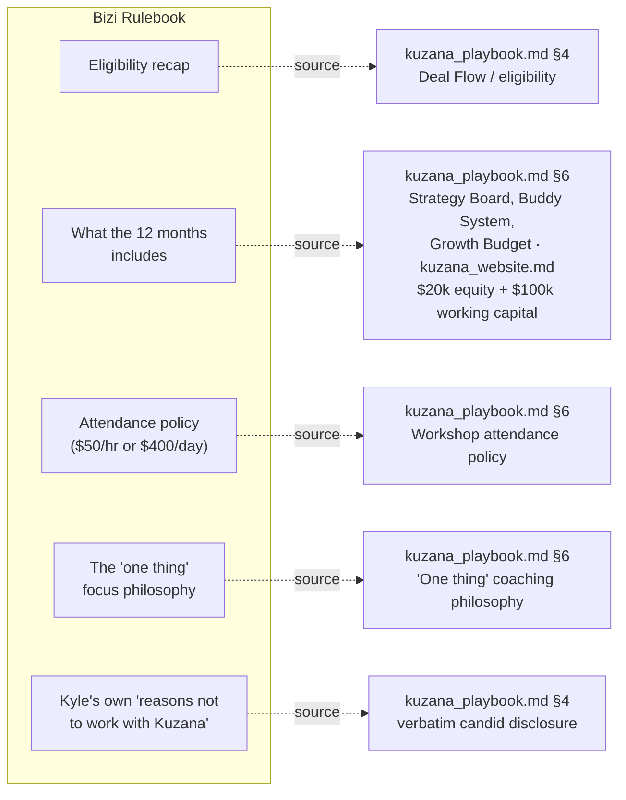
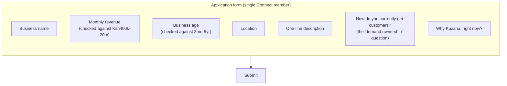
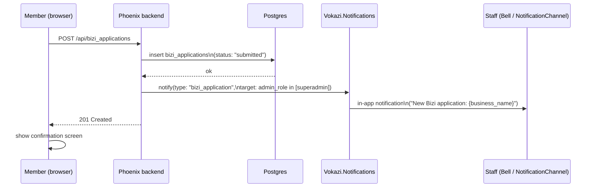
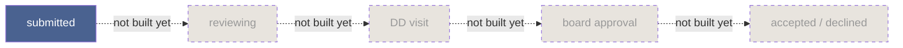
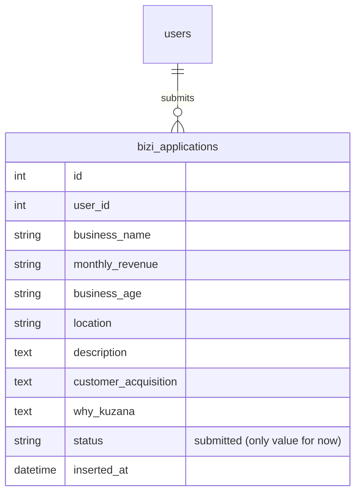

# Bizi Application & Rulebook — Flow Design

**Written 2026-07-27.** Scope locked with the product owner: **Apply + Rulebook only**, for
**existing Kuzana Connect members** (no separate public/cold-applicant form, no staff review
pipeline yet — see §5 for what that means and what's deliberately deferred). This doc is the
reference for building it; nothing here is built yet.

---

## 1. The member-facing journey

```mermaid
flowchart TD
    A[Signed-in Connect member] --> B[Home or Profile]
    B --> C["Apply to become a Bizi" card]
    C --> D[Bizi Rulebook screen]
    D -->|just wants to read the rules| B
    D -->|ready| E[Application form]
    E --> F{All required fields valid?}
    F -->|no| E
    F -->|yes| G[Submit]
    G --> H[(bizi_applications row created,\nstatus = submitted)]
    H --> I[Confirmation screen:\n"Submitted - we'll be in touch"]
    I --> J[Profile: "My Application" status,\nrevisit anytime]

    style H fill:#4a6290,color:#fff
```

Two things worth being deliberate about, both already true in the diagram above:

- **The Rulebook is never gated behind starting an application.** Anyone can read it out of pure
  curiosity - it's reference content, not a funnel step. That matches the discovery report's own
  finding that vetting/rules being clear upfront builds trust, not friction.
- **There's exactly one outcome state right now: `submitted`.** No fake progress bar, no invented
  "under review" animation implying activity that isn't real - matching the same honesty standard
  already applied to `InterviewProcessing.jsx` and the phone-verification copy earlier in this
  build.

## 2. What's actually in the Rulebook (source: `kuzana_playbook.md`, not invented)



Every section traces back to a real source document - nothing here is generic accelerator
boilerplate.

## 3. The application form itself

Grounded in Kuzana's real two-stage process (`kuzana_playbook.md` §4: *"Screening App - get email"*
→ *"Full App - get financial and relevance of business details to screen"*), collapsed into one
form for this MVP rather than two separate steps, since there's no review pipeline yet to hand off
between stages:



The revenue/age fields are checked client-side against the real eligibility bands as a soft
heads-up ("this is outside Kuzana's usual range - you can still apply") - **never a hard block**.
Kuzana's own process still runs a human screening call regardless; the form's job is to collect
honest information, not to gatekeep automatically.

## 4. System sequence - what happens on submit



This reuses `Vokazi.Notifications` exactly as it already exists today - no new admin screen, no
review-pipeline states. Staff see it lands, the same way they already see a new match or a chat
message. **This is the one piece I flagged as a judgment call, not yet confirmed** - if you'd rather
have zero staff-facing signal in this first pass, this step (and only this step) drops out cleanly
without touching anything else in the diagram.

## 5. What's deliberately NOT in this build (so nobody mistakes silence for an oversight)



Everything past `submitted` - the actual screening call, DD visit, reference checks, board
approval, and all legal/equity paperwork - **stays exactly where it already lives**: Felicity's
calls, Kuzana's own contracts via eSignatures, real bank transfers. This system's only job is to
replace the Google Form at the front of that process with something that captures real, structured
data and tells staff it happened. Building the rest of the pipeline is a real, separate decision for
later, not an accidental gap in this one.

## 6. Data model



One `users` row can submit more than one `bizi_applications` row over time deliberately (no unique
constraint) - a member whose business changes significantly, or who was declined once, shouldn't be
architecturally blocked from applying again later.

---

*Companion docs: `kuzana_playbook.md` (§4, §6 - the source of every Rulebook section and every form
field), `kuzana_website.md` (real program numbers referenced in the Rulebook), `Admin panel.md`
(§1's boundary statement about the accelerator pipeline is being consciously revisited by this
build, not silently violated - worth a follow-up edit there once this ships).*
