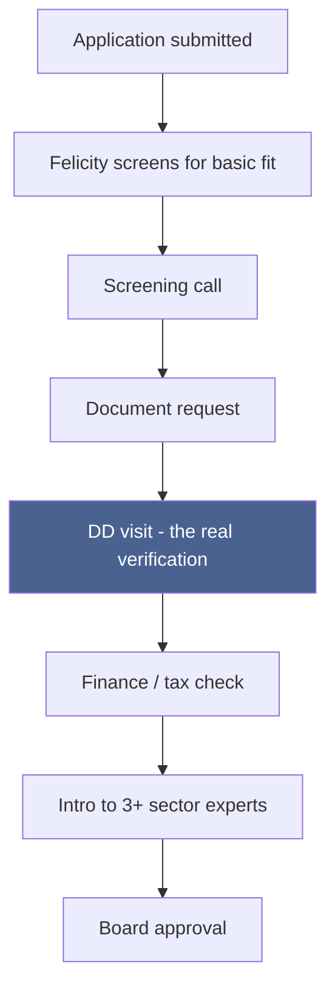

# Kuzana's Real Bizi Verification Process

**Written 2026-08-01.** Source: `kuzana_playbook.md` §4 (Deal Flow / Investment Process) and
`kuzana_website.md` §9 (the live application form). This is Kuzana's actual, real process for what
happens after a Bizi application is received, up through the point they've genuinely verified the
applicant - not a Connect feature, and not built into the product (see `bizi_flow.md` §7's explicit
boundary: everything below stays on Kuzana's existing process, off-platform).

---

## The full arc, stage by stage

### 1. The application is already a two-part filter
Kuzana's own process treats this as two stages - "Screening App" (whose only real job, per the
Playbook, is to "get email") and "Full App" (financials and business-relevance detail, enough to
screen properly). Connect's own Bizi application form (`bizi_flow.md`) merges both into one pass,
since the applicant is already a known, signed-in Connect member.

### 2. Someone actually looks at it
Owned specifically by **Felicity** (per the Playbook's CG Handover table): *"responding to
applicants on the portal, review email 'maybe' responses quality and determine next steps."* Nothing
is verified yet at this point - this is a basic-fit screen against Kuzana's real criteria:

- Ksh400k-20m monthly revenue
- Business 3 months-5 years old
- Operating in Kenya
- **"Demand ownership"** - a real, repeatable, founder-driven way of acquiring customers, not just an
  idea
- Rules out "pedigree" founders (ex-Google, Harvard-credentialed) commanding inflated valuations,
  regardless of revenue

### 3. The screening call
A real phone conversation, not automated. Assesses: needs, personality fit, computer literacy,
timeliness, business model, whether Kuzana's investment is actually viable for this founder, and
whether they'd accept Kuzana's funding terms at all. This is Felicity's "initial screening call to
determine viability" step - passing it gets you handed to the next stage.

### 4. Document request - the paper trail starts
Kuzana asks for:
- Last year's management accounts
- CR12 (the real Kenyan company registration document listing directors/shareholders)
- Enough purchase/sales documentation to calculate gross profit independently, rather than trust a
  self-reported number

They also send the applicant a podcast or article and watch **how they respond to it** - an
intentional, informal coachability test, done before the formal "growth mindset" checkbox on the
application even gets checked.

### 5. The DD (Due Diligence) visit - the actual verification moment
This is the real answer to "when do they verify the applicant" - and it's in-person, not a form
review:

- **Revenue verification**: claimed revenue is cross-checked against actual bank statements and
  whatever accounting system exists - never just the self-reported number.
- **Reference verification**: the applicant provides **5 customers and 5 creditors**, and Kuzana
  calls all of them directly - verifying the business relationship is real from the outside, not
  just from the founder's own account of it.
- **On-site presence**: per the Playbook's own site-visit script - the team shows up (or dials in
  remotely for anyone who can't attend in person), puts the founder at ease, walks through their team
  and roles, discusses sales/customers directly, revisits open questions from the application, and
  tours the facility itself. Literally seeing the operation exist, not reading about it.

### 6. Finance / tax check
A financial controller reviews everything gathered above and answers one blunt question: *"if they
were tax compliant, would they still be profitable?"* - checking whether profitability is real or an
artifact of unpaid tax obligations, plus any other red flags surfaced along the way.

### 7. Beyond verification (not part of this doc's scope, noted for completeness)
Once verified, the process continues into decision-making, not verification: intro to 3+ sector
experts to triangulate the key risk, board approval, then the offer/legal/tranche sequence already
documented in full in `kuzana_playbook.md` §4.

---

## What this means for Connect

Connect's Bizi application feature (`bizi_flow.md`) deliberately stops at **stage 1**. Everything
from stage 2 onward - the screening call, the document request, the DD visit, the reference calls,
the finance check - happens entirely off-platform, run by Felicity and the Kuzana team exactly as it
already does. The admin "Bizi Applications" review screen (`Admin panel.md`) gives staff visibility
into what was submitted at stage 1; it does not track, automate, or represent any of stages 2-7, and
isn't intended to unless that's a deliberate, separate decision later.

---

*Companion docs: `kuzana_playbook.md` §4 (the full, unabridged Deal Flow / Investment Process this
is drawn from), `bizi_flow.md` (Connect's own application feature and its explicit stage-1-only
boundary), `kuzana_website.md` §9 (the live form that is Connect's stage-1 equivalent).*
