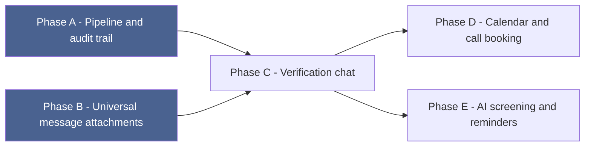

# Bizi Verification System — Build Plan

**Written 2026-08-01.** The phased implementation order for `bizi_verification_system.md`'s design.
Five phases, each independently shippable and verifiable - later phases depend on earlier ones for a
real reason (not just convenience), noted at each step. Nothing here is built yet.

---

## Dependency order

A and B have no dependency on each other and could be built in either order or in parallel. C
genuinely cannot start before B (the verification chat leans on the attachment primitive to receive
documents). E's AI-drafted messages have nowhere to go until C exists. D only needs C for logging
the booked call to the same timeline, not for its core Calendar API work.

---

## Phase A — Pipeline and audit trail (no chat/calendar/AI)

**Migrations**
1. Alter `bizi_applications`: expand status handling, add `assigned_to_admin_id`,
   `revenue_verified`, `board_decision_reason`, `decided_by_admin_id`, `decided_at`.
2. Create `bizi_application_stage_events`.
3. Create `bizi_application_references`.
4. Alter `users`: add `is_bizi`, `bizi_approved_at`.

**Backend**
- `Vokazi.Bizi.Application` - new `admin_changeset/2` (status/assignment/decision fields; the
  original `changeset/2` used at submission stays untouched).
- `Vokazi.Bizi.StageEvent`, `Vokazi.Bizi.Reference` schemas.
- `Vokazi.Admin.BiziApplications` gains: `advance_stage/4` (Ecto.Multi: status update + stage_event
  row, atomic), `add_reference/2`, `update_reference/3`, `assign/3`, `record_decision/4`
  (Superadmin-only, flips `is_bizi` + `bizi_approved_at` on approval, same Multi pattern).
- `VokaziWeb.Admin.BiziApplicationController`: `PATCH /stage`, `POST /references`, `PATCH
  /references/:id`, `POST /assign`, `POST /decision`.

**Frontend (admin)**
- `BiziApplicationDetailView.jsx`: stage-pipeline visual (mirrors the diagram in
  `bizi_verification_system.md` §2), the stage-events timeline, reference-list manager with a live
  "X of 10 contacted" counter, assign-owner control, decision panel (Superadmin-gated in the UI,
  server-enforced regardless).
- `BiziApplicationsListView.jsx`: add assigned-owner and stuck-indicator columns.

**Frontend (member)**
- `BiziSection.jsx`: show the application's current stage plainly (not the full staff timeline -
  that stays internal per §4/§10 of the system doc).
- `ProfileView.jsx`: "Verified Bizi" badge once `is_bizi` is true.

**Verify**: advance a real application through every stage manually via the admin UI, confirm the
stage_events timeline records each transition with the acting admin, confirm a Superadmin-only
`approved` decision flips `is_bizi` and the badge appears on the member's own Profile view, confirm
a Moderator account is correctly blocked from the decision endpoint.

---

## Phase B — Universal message attachments

**Migrations**
1. Create `message_attachments`.

**Backend**
- General file-storage module (local disk under the backend's own directory - see
  `bizi_verification_system.md`'s note on this needing a persistent Fly volume in production, not
  solved by this phase).
- `Vokazi.Chat.Message` / `send_message/3` gains optional attachment handling.
- Download/serve action gated by "must be a participant in this message's room."

**Frontend**
- Existing peer-to-peer `ChatSystem.jsx`: attach-a-file control, render received attachments
  (image preview, generic file download link for everything else).

**Verify**: send a real file between two matched members in the existing chat feature, confirm it
persists across a page reload and a container restart (proving the storage path is actually
durable in dev, not just in-memory for the session).

---

## Phase C — Verification chat (depends on B)

**Migrations**
1. Alter `chat_rooms`: make `match_id` nullable, add nullable `bizi_application_id`.
2. Create `bizi_application_documents`.

**Backend**
- `Vokazi.Chat`: participant-check branch for Bizi-scoped rooms (applicant + any active admin).
- `ChatRoomChannel`: same branch, join-authorization logic.
- `Vokazi.Admin.BiziApplications.open_verification_chat/1` (get-or-create).
- `tag_document/4` (message_attachment_id → document_type).

**Frontend**
- Admin: a lightweight chat panel inside `BiziApplicationDetailView.jsx` (join the same channel
  mechanics as member chat, simpler UI - no typing indicators needed).
- Member: verification chat view inside `BiziSection.jsx`.
- Admin: document list showing tagged attachments per type (management accounts / CR12 / purchase-
  sales docs / other), with an inline "tag this as..." action on any attachment received in the
  room.

**Verify**: as an applicant, send a real file in the verification chat; as an admin, tag it as the
CR12; confirm it appears correctly in the application's document list and never appears in the
member's regular Matches/chat surfaces.

---

## Phase D — Calendar / call booking

**Backend**
- New, deliberately simple flow (not the mutual-availability matcher) reusing the existing Google
  Calendar API client with the *staff member's own* connected credentials: propose a date/time,
  create a real Calendar event + Meet link inviting the applicant's email directly.
- Logs the booked time as a `bizi_application_stage_events` row (`kind: "note"`), notifies the
  applicant.

**Frontend**
- Admin: a simple "schedule a call" form in the detail view.

**Verify**: book a real call as a staff account with real Calendar credentials connected, confirm
the applicant receives an actual calendar invite with a working Meet link, confirm the stage
timeline reflects it.

---

## Phase E — AI screening and automated reminders (depends on C)

**Backend**
- `Vokazi.AI.screen_bizi_application/1` (same shape as `validate_match/2` - structured reasoning,
  never a bare verdict).
- Auto-triggered once on reaching `screening`; a manual re-run action.
- Writes a `kind: "ai_screening"` stage_event (`performed_by_admin_id: nil`) with the assessment and
  any drafted clarifying message.
- Oban `ReminderWorker`: stale `documents_requested` applications get an automatic nudge sent
  through the Phase C chat, logged as `kind: "reminder"` (`performed_by_admin_id: nil`).

**Frontend**
- Admin: AI-assessment panel in the detail view, with the drafted message shown as editable text and
  a "send" button that posts it through the same verification chat - never sent without that click.
- A Bizi decline-reasons aggregate view (mirrors the existing match decline-reasons tab).
- Stuck-indicator logic wired into the Phase A list-view column.

**Verify**: submit a genuinely incomplete/inconsistent test application, confirm the AI screening
produces a sensible drafted clarifying question (not silently sent), send it manually, confirm it
lands in the verification chat correctly attributed to the sending admin, not the AI. Let a test
application sit in `documents_requested` past the reminder threshold and confirm the automated nudge
fires with `performed_by_admin_id: nil` on its stage event.

---

*Companion docs: `bizi_verification_system.md` (the architecture this implements),
`bizi_verification.md` (the real Kuzana process behind it all), `bizi_flow.md` (the MVP this
extends), `Admin panel.md` (the access-control system this plugs into).*
