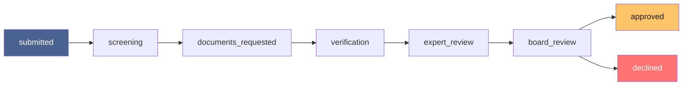
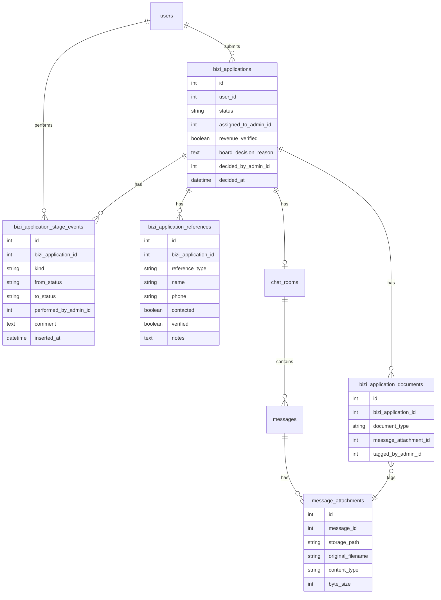

# Bizi Verification System — Design

**Written 2026-08-01.** Extends the Apply + Rulebook MVP (`bizi_flow.md`) into the real, staged
verification pipeline documented in `bizi_verification.md` (Kuzana's actual process: screening →
documents → DD visit/references/finance check → expert review → board decision). This doc is the
architecture; `bizi_verification_build_plan.md` is the phased build order. Nothing here is built
yet.

---

## 1. Why this looks the way it does

Two rules governed every decision below, both pulled directly from Kuzana's own stated philosophy:

- **"Enter each fact once"** (`kuzana_playbook.md` §9) - narrative history (who did what, when, with
  what comment) lives in exactly one table, not duplicated across note fields on the application
  row itself.
- **AI assists, humans decide** - already the pattern for peer matching (`Vokazi.AI.validate_match/2`
  never auto-connects anyone). The same rule applies here: AI screening drafts, a human sends.

## 2. The stage pipeline

`verification` deliberately collapses the DD visit, the 5+5 reference checks, and the finance/tax
check into one stage - in Kuzana's real process these happen together around a single site visit,
and manufacturing three separate stage transitions for something staff experience as one event
would be exactly the "overcomplicated tooling" Kuzana's own Playbook warns against.

Any stage can transition directly to `declined` - decline isn't only a `board_review` outcome, it's
a real possibility at every stage (a screening call can end things just as finally as a board vote).

## 3. Data model

**`performed_by_admin_id` is nullable on purpose** - `null` means system-generated (an AI screening
assessment, an automated reminder), never a human pretending to be the system or vice versa. This is
how "who did each stage" stays honest even once automation exists.

**`bizi_application_documents` never stores a file itself** - it tags a `message_attachment_id`
staff already received through the verification chat as "this is the CR12" / "this is management
accounts." One upload primitive (`message_attachments`), not two competing ones.

## 4. Stage history is the audit trail, not a side effect of it

Every `advance_stage` call writes exactly two things atomically (same `Ecto.Multi` pattern already
used everywhere else in `Vokazi.Admin.*`): the `bizi_applications.status` update, and a
`bizi_application_stage_events` row with `kind: "stage_change"`. The events table is queried
directly to render the timeline - it isn't reconstructed from `admin_audit_logs` (which still gets
its own generic entry too, matching every other admin mutation) because the *narrative* (a real
comment explaining the decision) belongs to the application's own case file, not buried in a
system-wide log meant for security review.

## 5. Chat: one room type, two possible scopes

`chat_rooms.match_id` becomes nullable; a new `chat_rooms.bizi_application_id` sits alongside it. A
room is scoped by exactly one of the two - never both, never neither. This is a genuine either/or,
not a shared "chat room" concept diluted to fit two purposes:

- **Match-scoped room**: participants are the two matched members, exactly as today.
- **Bizi-scoped room**: participants are the applicant plus **any currently-active Moderator or
  Superadmin** - not one fixed staff member, since anyone on the team might need to step into the
  conversation. `ChatRoomChannel`'s participant check grows one branch for this case; the message-
  sending mechanics themselves (the channel, the message list, notifications) are identical either
  way, which is the entire point of extending the existing table instead of building a parallel one.

This keeps peer-networking chat and staff-verification chat structurally distinct - a verification
thread can never surface in a member's regular Matches tab or get counted in match stats, because
it's a different scope on the same table, not a special-cased match.

## 6. Message attachments are a general feature, not a Bizi-only add-on

`message_attachments` attaches to any `message`, in any chat room, match-scoped or Bizi-scoped. This
was a deliberate call (confirmed with the product owner) over scoping it to verification chats first
- it means Phase B of the build (`bizi_verification_build_plan.md`) touches the *existing* peer chat
UI before Bizi verification chat even exists, but avoids a second migration and a second "add file
support" pass later.

## 7. Calendar / call booking - reusing the API client, not the matching algorithm

The existing scheduling feature (`Vokazi.Scheduling`) solves *mutual availability between two peers*
- intersecting both people's free slots. That's the wrong shape here: staff aren't negotiating
availability symmetrically with an applicant, they're offering a specific time, like a clinic
booking. So this reuses only the low-level piece - the Google Calendar API client that actually
creates a real event with a Meet link, called with the *staff member's own* connected credentials,
inviting the applicant's email directly. No `SlotMatcher`/multi-candidate-slot machinery involved.
The scheduled time gets logged as a `bizi_application_stage_events` row (`kind: "note"`) and
triggers a notification to the applicant.

## 8. AI screening - drafts, never sends

`Vokazi.AI.screen_bizi_application/1` follows the exact shape of `validate_match/2`: a Gemini call
that returns structured reasoning, not a bare verdict. It runs once automatically when an
application reaches `screening`, and can be re-run manually. Output: a completeness/consistency
assessment (is the business description substantive, does the selected track match what's
described, any internal contradictions) plus, if something's genuinely unclear, a **drafted**
clarifying message.

That draft is stored as a `bizi_application_stage_events` row (`kind: "ai_screening"`,
`performed_by_admin_id: nil`) and shown to whichever Moderator opens the application. A human
reviews it, edits if needed, and sends it themselves through the Phase C verification chat. It is
never sent automatically - the same "AI proposes, human disposes" rule that already governs mutual
consent for matches applies to a real applicant's experience of a real funding process.

## 9. Automated reminders - the one place full automation is fine

Unlike AI screening (which touches judgment), a reminder nudge for a stale `documents_requested`
application involves no judgment at all - it's purely operational. This runs as an Oban worker
(matching the existing reminder-worker pattern already used elsewhere in the app), sends via the
verification chat automatically, and logs a `kind: "reminder"` event with `performed_by_admin_id:
nil`.

## 10. Access control

| Action | Minimum tier |
|---|---|
| View application, stage history, stats | Support |
| Advance stage (submitted → board_review), manage references, tag documents, open/use verification chat, book a call, review/send AI-drafted messages, assign an owner | Moderator |
| Record the final board decision (approve/decline), which flips `users.is_bizi` | **Superadmin only** |

Matches the existing Admin Panel's tiering exactly - Moderator mirrors Felicity's real
Applications-owner role, Superadmin mirrors Kyle's real board-decision authority
(`kuzana_playbook.md` §3).

## 11. Smaller professional touches folded in

- **Stuck indicator**: flag any application idle past N days in its current stage - reuses the same
  `stuck` filter concept already built for Members.
- **Decline reasons at every stage**, not just `board_review` - mirrors the existing match
  decline-reasons aggregate, giving Kuzana real data on *where* and *why* applicants actually fail
  over time.
- **Named owner** (`assigned_to_admin_id`) - any Moderator can still act on any application; this is
  a visibility convenience matching how Kuzana already assigns Applications ownership to Felicity
  specifically, not a hard access lock.
- **Live "X of 10 references contacted" counter** in the verification stage UI - same
  honest-progress pattern already applied to the member-facing eligibility checklist.

---

*Companion docs: `bizi_verification.md` (the real Kuzana process this is built from), `bizi_flow.md`
(the Apply + Rulebook MVP this extends), `Admin panel.md` (the tiering/access-control system this
plugs into), `bizi_verification_build_plan.md` (the phased implementation order).*
